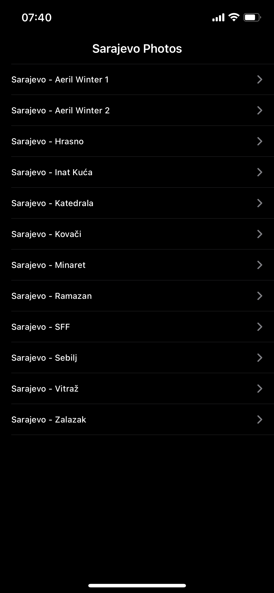

# Photos of Sarajevo
  

Images of Sarajevo that can be shared!
  

  
  

All your favorite images in one place. Using File Manager and selecting the prefix of the image file, images were loaded into the application.

  

Users can share those images one by one using rightBarButton. Since copyright policy should be respected, if images are screenshotted, an alert will pop up to inform the user that he took a screenshot.

  
  

